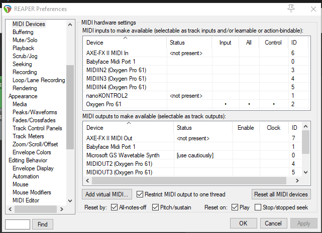
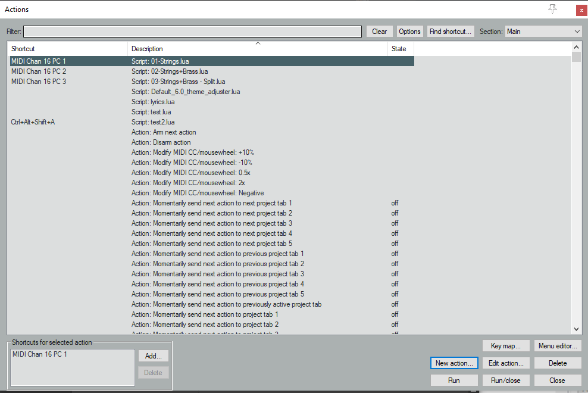

# Warfarer - PresetinJuilauttaja 0.2

Release 2024-03-10

1. Tee Reaperiin 2 raitaa, joiden nimet on

   - "NUC - Strings"
   - "NUC - Brass"

    Näitä voi muuttaa kunhan tekee muutokset myös `Tracks.lua`-tiedostossa olevaan raitakonfiguraatioon. Jos tulee uusia raitoja, pitää ne myös lisätä konfiguraatioon.

2. Laita kullekkin raidalle ENSIMÄISEEN fx-slottiin "MIDI Note Filter". 
   - Aseta "Other events (CC, etc) pass through: Yes.

3. Laita kullekkin raidalle Note Filterin jälkeen Kontakt (tai mikä tahansa muu) softasyna ja lataa siihen haluamasi patchi. Tarkoitus on käyttää jokaiselle patchille omaa Kontakt-instanssia.

4. Mene Reaperin "MIDI Devices"-asetuksiin ja aseta haluamasi midiohjaimet käyttöön. Sen ohjaimen kohdalla, jolla on tarkoitus komentaa presetinvaihtoscriptejä tulee olla myös "Control". Ks. kuvan "Oxygen Pro 61"

    

5. Mene Reaperin "Actions" valikkoon painamalla "?". Klikkaa "New action" -> "Load ReaScript..." ja valitse `01-Strings.lua`. Bindaa tälle scriptille pikänäppäimeksi joku Midi Controllerilta tuleva Program Change-komento.

    

6. Toista kohta 5. muille skriptitiedostoille.


## Skriptien käplintä ja uusien rakentaminen

Skriptit vaativat samaan hakemistoon `Tracks.lua`-  ja `PresetinJuilauttaja.lua`-tiedostot.

Kunkin skriptitiedoston alussa tarvitaan 3 riviä boilerplate-koodia:

``` lua
package.path = package.path .. ";" .. string.match(({reaper.get_action_context()})[2], "(.-)([^\\/]-%.?([^%.\\/]*))$") .. "?.lua"
local pj = require "PresetinJuilauttaja"
local tracks = require "Tracks"
```

Tämä jälkeen voi asettaa päälle raitoja, viittaamalla niihin `Tracks.lua`-tiedostolla määritetyillä nimillä.

``` lua
pj.useTracks(tracks.strings)
```

Useamman raidan saa samanaikaisesti päälle antamalla `useTracks`-funktiolle useamman parametrin.

``` lua
pj.useTracks(tracks.brass, tracks.strings)
```

Splitin saa tehtyä:

``` lua
pj.createSplit(tracks.strings, tracks.brass)
```
